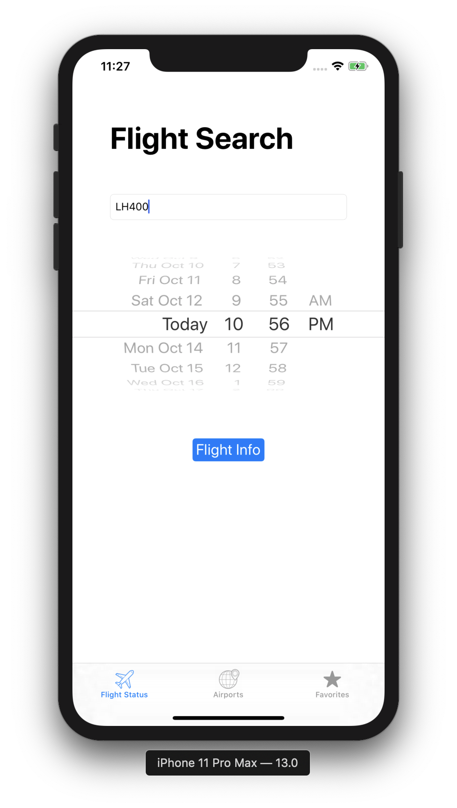
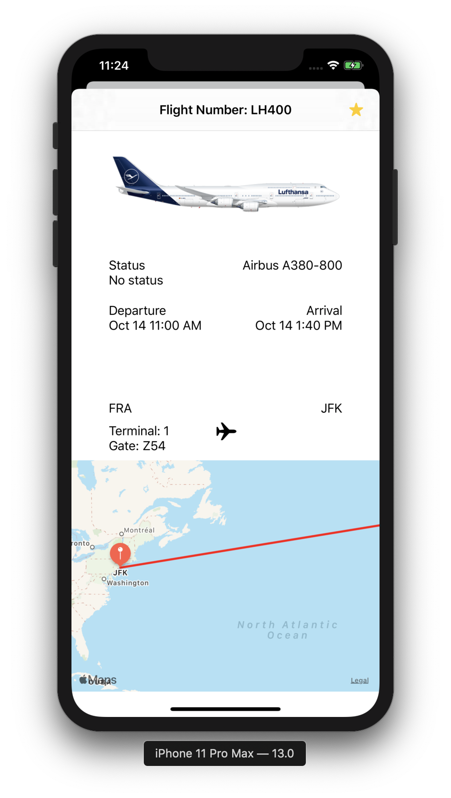
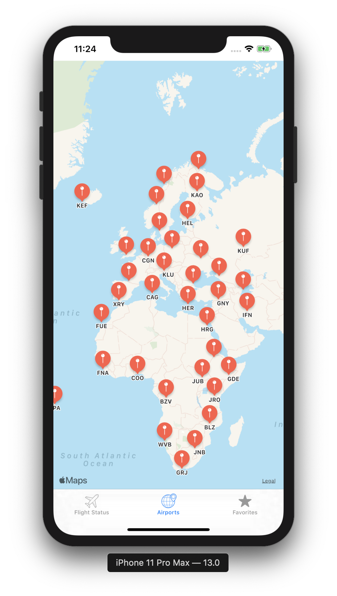
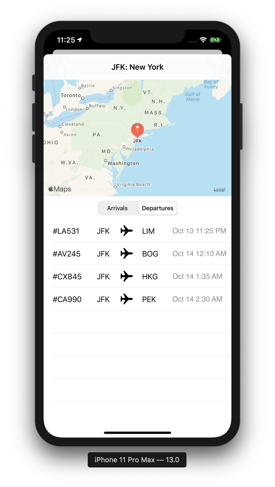

# MDB Mini Project 4 - Lufthansa Flight Tracker
This app uses Lufthansa's REST API to allow users to search through all flights and view flight details. Users can favorites certain flights and can also view a map of all airports Lufthansa services. They can also go from the map to specific airports to view departures and arrivals at each airport.

Search Screen

Flight Details Screen

Map Screen

Airport Details Screen
